<!-- 40+20 -->

<!-- Description: Uncertainty can impact games given the numerous uncertainties involved, from supporting a wide range of hardware architectures and interfaces to managing unexpected human interactions.  The failure of systems in gaming due to uncertainty, whether a hard crash or a performance slowdown, can lead to player frustration and disengagement.  In this talk I will discuss approaches that my lab has explored for both discovering and managing uncertainty from a software engineering perspective that can be applied to games, from requirements monitoring at run time to search-based fuzz testing.  I'll also cover its applications in other domains such as safety-critical systems and algorithmic art to demonstrate the domain-independence of these techniques.  I'll end with a discussion of potential future directions that can be explored in the context of uncertainty and game development. -->

<!-- # Bridging Esoteric Software Engineering Practices to the Video Games Domain -->
<!-- # Opportunities for Esoteric Software Engineering Practices in Games -->
# Opportunities for Esoteric Software Engineering Practices for Managing Uncertainty in Games

<!-- _paginate: false -->

### FaSE4Games Keynote (07/06/2026)

Erik Fredericks, frederer@gvsu.edu

> [https://efredericks.github.io](https://efredericks.github.io)

---

<!-- _paginate: false -->
# Quick plug

<h3 style="padding:1em !important">
Roguelike Celebration 2026 is looking for talks!  

https://www.roguelike.club/ -- submit by July 17

</h3>

---

<!-- _footer: . -->

<h1><mark>Acknowledgements</mark></h1>

<b>Current/Former Students</b>

(Too many to list, but most recently)

<ul>
<li>Abigail Diller</li>
<li>Steven Streasick</li>
<li>Mallory Jacobs</li>
<li>Skyler Burden</li>
<li>Cameron Schneider</li>
<li>Andrew Goodling</li>
<li>Astha Thapa</li>
<li>...and more!</li>
</ul>

<b>Collaborators and Mentors</b>
<ul>
<li>Byron DeVries</li>
<li>Jared Moore</li>
<li>Ira Woodring</li>
<li>Betty H. C. Cheng</li>
<li>Austin Ferguson</li>
<li>Alex Lalejini</li>
</ul>

<b>Sponsors</b>
<ul>
<li>Grand Valley State University</li>
<li>Michigan Space Grant Consortium</li>
<li>National Science Foundation</li>
</ul>

<!-- primarily undergrad institution -->

---

# What is the purpose of this keynote?

Dealing with **uncertainty** and its insidious impacts on software systems

More specifically?
- Inducing performance slowdowns
- Crashes!
- Causing requirements violations, test case failures, etc.

<!-- _footer: Photo by Михаил Крамор from Pexels: https://www.pexels.com/photo/angry-girl-sitting-at-desk-in-classroom-16876741/ -->

---

# Why is this interesting to you specifically?

<!-- I'm not pitching you a career's worth of work but rather opportunities for future work
- And things I find interesting anyway -->

What we'll be talking about :

- Recognizing and quantifying uncertainty
- Techniques for managing uncertainty
- Potential future options in this area 

Also:

- Things *I* find interesting, perhaps you will as well!

---

# Who am I?

<!-- _paginate: false -->
<!-- _footer: (**crowning achievement) -->

- Until recently, a person who has focused on managing uncertainty in safety-critical systems with search-based software engineering 

  - Safety-critical systems [21,38] / robotics [23] 
  - Self-adaptive systems [18]

- And then:

  - Algorithmic art [27]
  - Procedural content generation [26]
  - SIGBOVIK contributor [19] **

  
---

# What is uncertainty?

Uncertainty is:

- Insidious
- Difficult to quantify
- Difficult to *recognize*

Uncertainty causes your software to react/behave in ways unintended
- This should worry you as a software engineer!

<!--
- Robots crash and people die
- Video games crash and people trash your game online
- Deviates from your requirements!
-->

<!-- _footer: Photo by Julia Filirovska from Pexels: https://www.pexels.com/photo/misted-window-with-question-mark-4913769/ -->

---

# Consider...

<!-- incomplete or uncertain information -->

You are programming a robot

  

    <ul>
      <li>A camera lens gets scratched</li>
      <li>A sensor gets bumped and becomes misaligned</li>
      <li>A typo is entered into a config file</li>
    </ul>
    <b>How does that impact the robot's goals?</b>
  

  

  <iframe width="560" height="315" src="https://www.youtube.com/embed/svovLytCkMw?si=GbgPbsBMpvcl0JiJ" title="YouTube video player" frameborder="0" allow="accelerometer; autoplay; clipboard-write; encrypted-media; gyroscope; picture-in-picture; web-share" referrerpolicy="strict-origin-when-cross-origin" allowfullscreen></iframe>
  

<!-- 
what is the uncertainty here?
or impact its reqs?  what do the people see?
-->

---

# Defining uncertainty

Interestingly, there are a plethora of ways to describe uncertainty depending on your domain [46,55,59,67,...].

| **Type** | **Description** | 
| ----------- | ----------- | 
| **Known known** | We **know** the source **and** how much impact it will have |
| **Unknown known** | We **don't know** the source but do **know** its impact |
| **Known Unknown** | We **know** the source but **don't know** its impact |
| **Unknown unknown** | We **don't know** the source and **don't know** its impact |

<!-- _footer: . -->
<!-- could also go the aleatory (inherent randomness/noise) and epistemic (lack of knowledge) route as well -->

---

# Defining uncertainty

<!-- _footer: . -->

This leads us to identifying the:

<ul>
<li><strong>Sources of uncertainty</strong></li>
<li><strong>Impact of uncertainty</strong></li>
</ul>

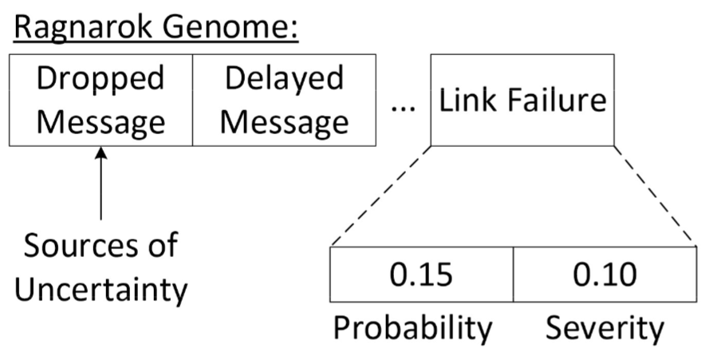

Genome for remote data mirroring application with Ragnarok genetic algorithm [68]

It is <mark>humanly impossible</mark> to enumerate all possible combinations of each [6,10,47]

<!--
can we find the most impactful or put the system into a good enough state
-->

---

<!-- _footer: . -->

# Examples of uncertainty

Safety-critical systems [38]
* Unexpected weather
* Human interaction
* System misconfiguration

Video games
* Network issues (also works for above)
* Human interaction
* System misconfiguration

*Formal methods for quantification exist as well via probability analysis, statistical modeling, etc.* [49]

---

# How can we handle it from a software engineering perspective?

- Verification and validation [5,44,67]
- Machine learning [15,56]
- Agentic monitors [64-66]

&nbsp;

- Search-based software engineering **
- Run-time monitoring **

<!-- preprints on agentic - bleeding edge! -->

---

# Software engineering and uncertainty

<!-- _footer: . -->

Monitoring for problems:

<ul>
<li>
Robot with random sensor failures/degradations
</li>
<li>
Remote data mirroring with severed links
</li>
</ul>

Experiencing:

<ul>
<li>
Poor performance
</li>
<li>
Violated invariants
</li>
<li>
Unsatisfied requirements
</li>
</ul>

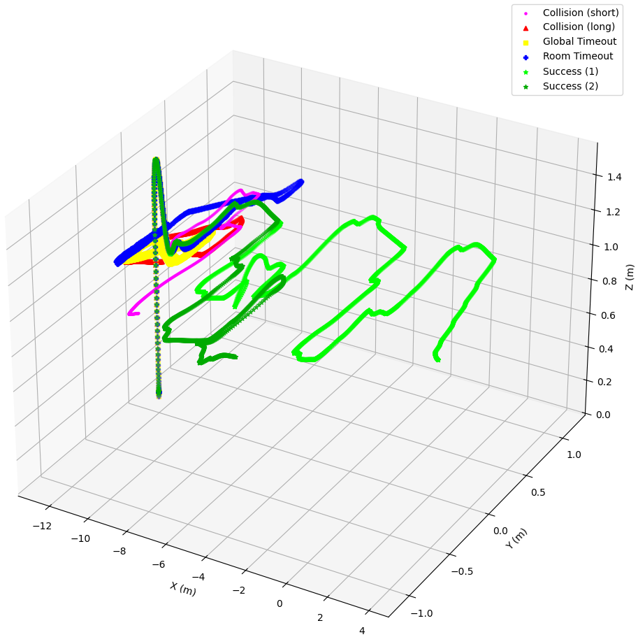

Scatter plot of drone position over multiple runs [29]

<!-- plot of drone position over multiple runs. green is success. uncertainty is the environmet layout -->
---

# Software engineering and uncertainty - How do we know?

<!-- _paginate: false -->

<!-- _footer: Background photo by Mahoney Fotos from Pexels: https://www.pexels.com/photo/close-up-of-tree-logs-lying-in-a-forest-20442681/ -->

Post-analysis with logs, but *often performed prior to release*
- Logs can get <mark>big</mark>

Run-time monitoring - though incurs additional overhead 

- *Lightweight* satisfaction monitoring *at run time* -- utility functions [12,43,58]
  - **Satisfaction**: requirement or goal's performance is *acceptable*
  - Derive mathematical functions for each requirement/goal to assess performance

---

# Utility functions [12,43,58]

<!-- _footer: . -->

$Goal_a$: [Maintain] >= 30\% $battery_{perc}$
<!-- $util_{a}$ = $1.0~if~battery_{perc}~>=~30\%~else~0.0$ -->
$$
util_{a} = \begin{cases} 
    1.0 & \text{if } battery_{perc} \ge 30\% \\
    0.0 & \text{else} 
\end{cases} 
$$

$R_1$: At least 60% of the walkable areas of game map must be accessible.

$$
util_{R1} = \begin{cases} 
    \frac{x - 0.6}{0.4} & \text{if } |cells_{walkable}| \ge |cells| * 0.6 \\
    0.0 & \text{else} 
\end{cases} 
$$

Normalize on [0.0, 1.0] - 0.0 is a violation, 1.0 is satisfaction, (0.0, 1.0) is *degree of satisfaction*

<!-- can be used to make decisions -->

---

# Adding flexibility

<!-- _footer: . -->

Typical requirements are **brittle**
- No room to tolerate *transient* failures

**Consider**: 

[Maintain] >= 30% battery 

[Achieve] >= 30% &plusmn; 5% battery

KAOS goal notation [10,57]:
- [Maintain] is an **invariant**
- [Achieve] is a **non-invariant** &rarr; *can temporarily tolerate failure!*

<!-- goal: higher level of abstraction -->

---

# KAOS goal example

<!-- _footer: . -->

  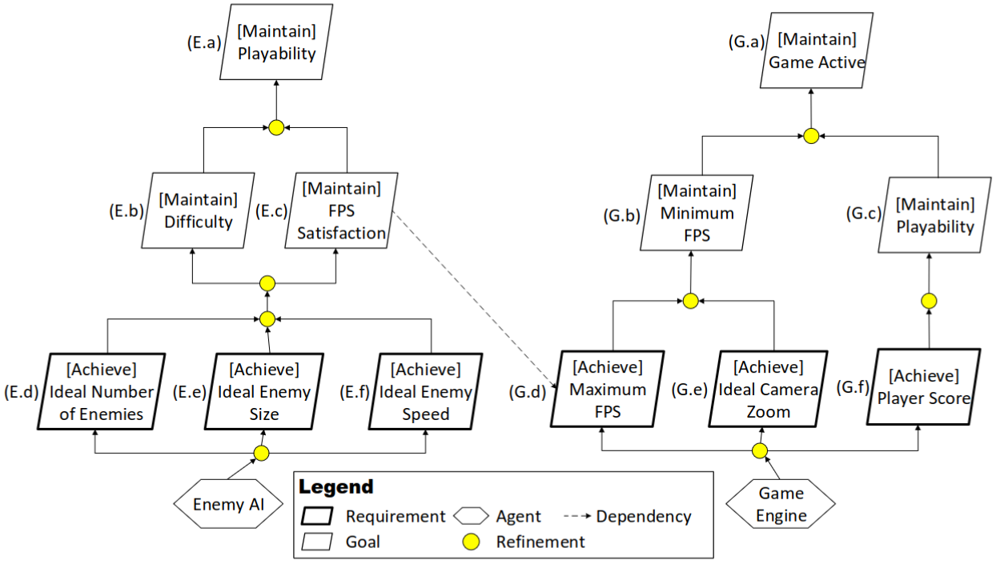

KAOS goal model describing multi-agent system in game [52].

<!-- lots of maintains - brittle! -->
---

# RELAX specification language [60]

<!-- _footer: . -->

Introduce fuzzy-logic membership functions to requirements that can be *temporarily* unsatisfied
- E.g., return to charging station when battery percentage is `AS CLOSE AS POSSIBLE TO` 30% (triangle function)

  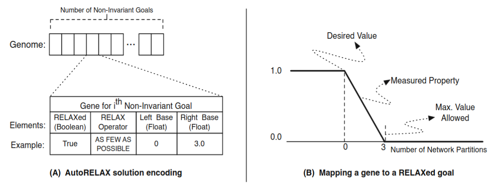

Encoding a candidate solution in AutoRELAX (left shoulder) [18,42]

<!-- left shoulder : as few as possible -->

---

# Current takeaways

<!-- _footer: GIF: The Muppet Movie - Movin Right Along -->
<!--  -->

<!-- _footer: . -->

<!-- 
a lot of human/socio-centric works out there, not as much in terms of SE 
- regardless of how you plan (requirements, fuzzy logic, formal models), do it!
-->

<b>Plan for</b> and <b>proactively mitigate</b> uncertainty

- Does it matter for games?

  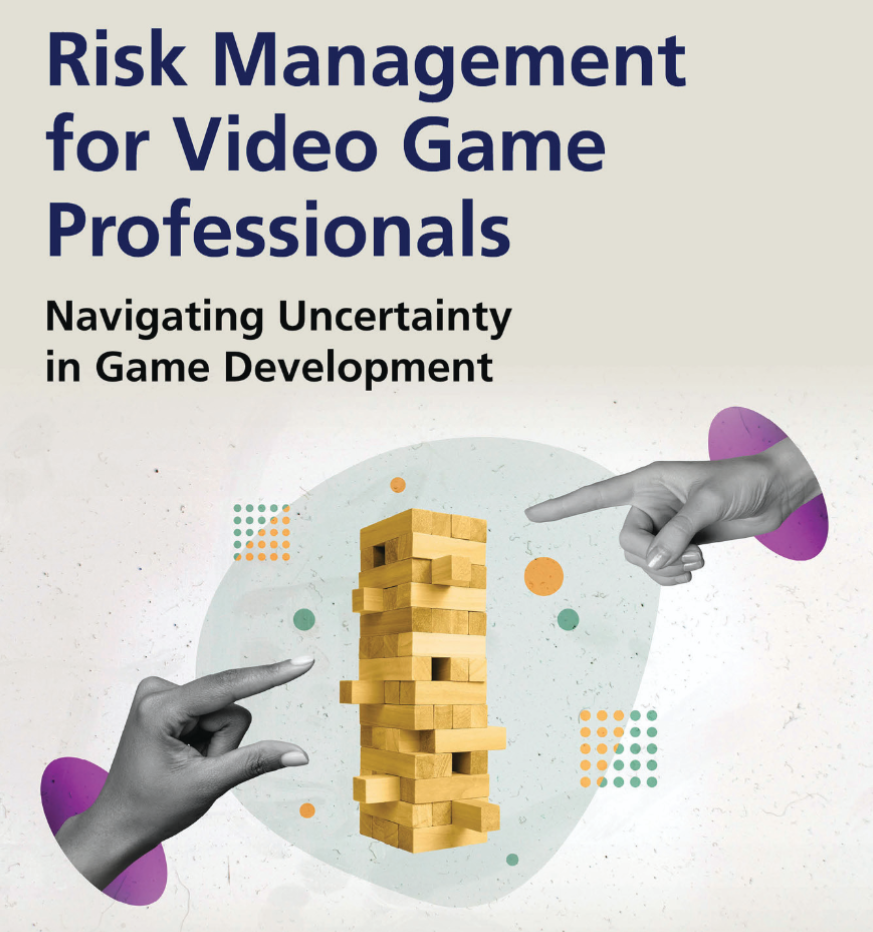 
  
Risk Management for Video Game Professionals Cover [61]

  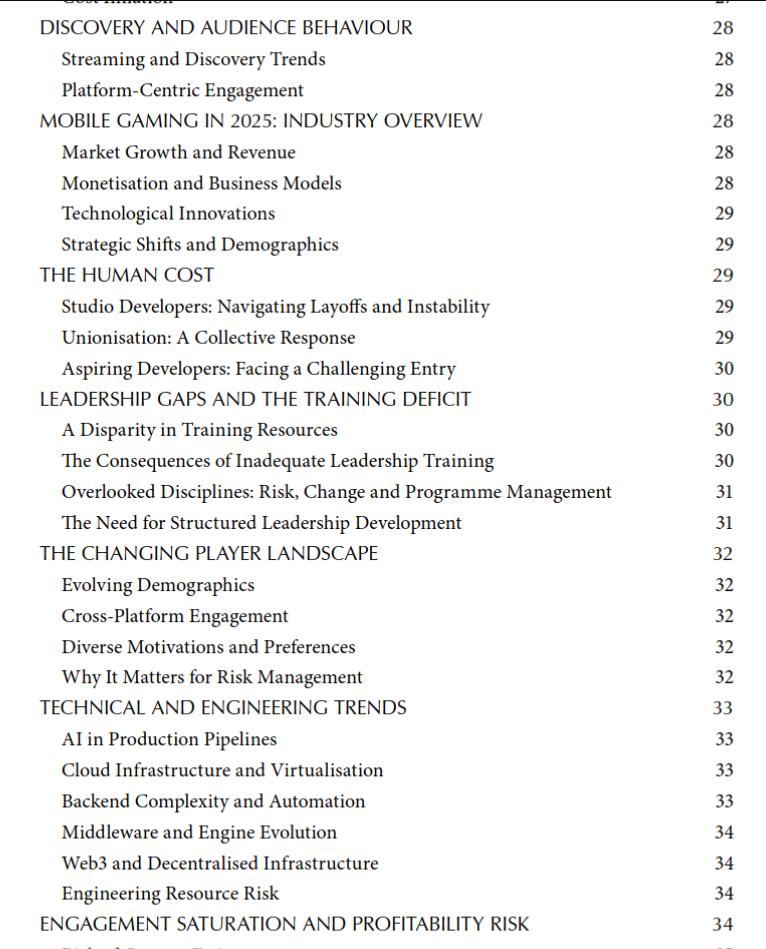  
  
Risk Management for Video Game Professionals TOC [61]

---

# How can we take all of *this* (gestures broadly at previous slides) and put it together?

---

# Search-based software engineering (SSBSE)

<!-- _footer: . -->

Evolutionary computation [32] for optimizing solutions for SE problems:
  E.g.:

<ul>
<li>Optimizing test case prioritization</li>
<li>Generating fuzz test data</li>
<li>Improving requirements satisfaction</li>
</ul>

  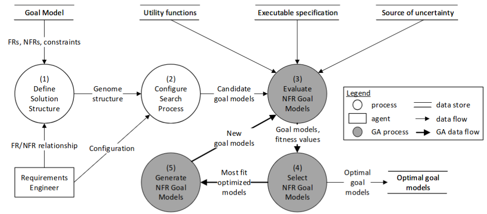  
  <!-- 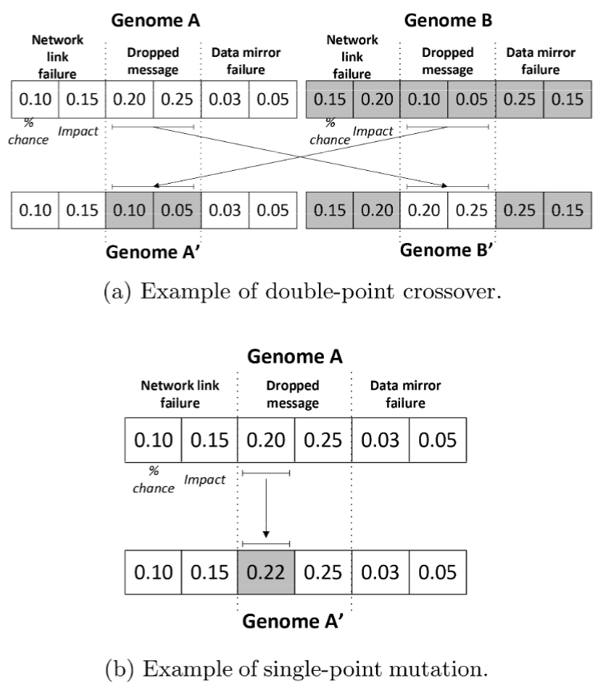   -->
  
Providentia data flow diagram [3]

<!-- if you have a hammer ... -->

---

# Evolutionary computation (briefly)

Search heuristic that aims to generate an *optimal* solution to a *difficult* problem

**Requirements**

- Solution representation
- Fitness measure

Iterate until your solution is *good enough* or you run out of time!

Can go beyond with diversity [36], multi/many-objective optimization [11,35,37], etc.

<!-- _footer: Background image: https://www.yourgenome.org/theme/what-is-dna/ -->

---

# An SSBSE example (self-adaptive systems) [68]

1. Breaking the system
    * Run a genetic algorithm to cause the system to **violate as many requirements as possible**
2. Fixing the system
    * Run another genetic algorithm to **optimize the system's configuration** to resolve the violations from (1)

* **Utility functions** used to monitor performance and serve as a fitness function 

---

# An SSBSE example 

<!-- _footer: . -->

  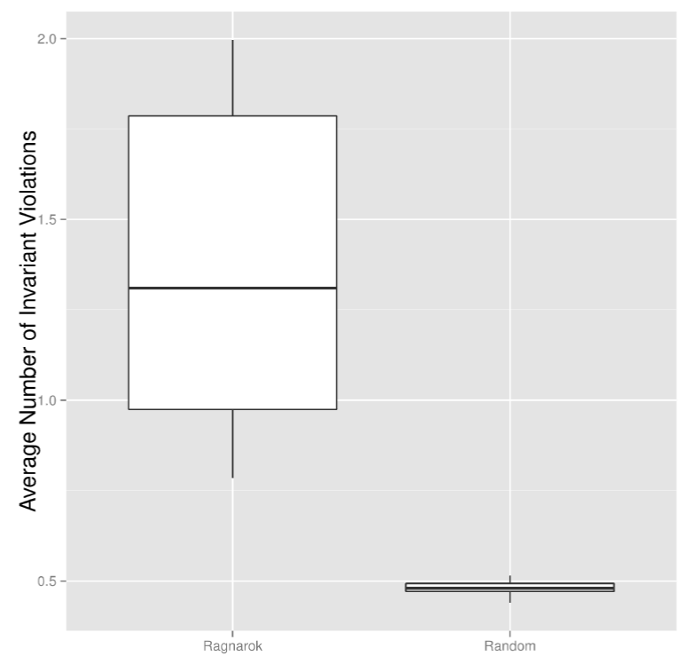
  
Comparison of Remote Data Mirroring invariant goal violations between Ragnarok (GA-1) and random search [68].

  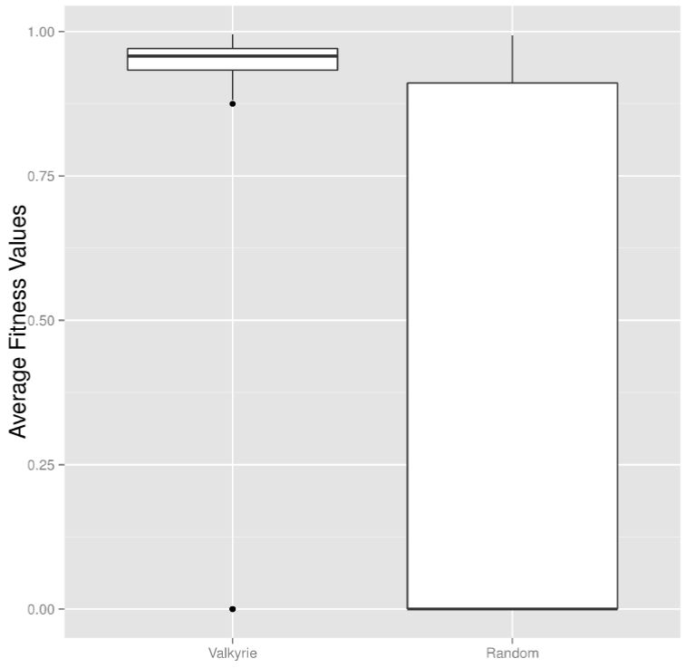
  
Comparison of average fitness values between Veritas (GA-2) and random search [68].

---

<h1 style="text-align: center !important">Leaving the safety-critical space</h1>

<!-- 
how can evolution be used elsewhere
-->

<!-- _footer:. -->

---

# Using evolutionary computation and software engineering to create glitch art

## GenerativeGI [27]

- Many-objective search with Lexicase selection

- Fitness proxies for aesthetic preference
 
  - Maximizing pixel differences in images
  - Maximizing negative space
  - Maximizing diversity of drawing techniques
  - ...

<!--
* learned that pixel differences are useless
* move to ML
-->

---

<!-- _footer: . -->
<!-- _paginate: false -->

<!-- more up on my website 
pixel sorting
circle packing + thresholding
watercolor potentially
-->

---

<!-- _footer: . -->

# Genetic improvement: databending [20]

- Using PyGGI [1] to optimize an open source glitch tool's **code** 

- Fitness: maximize **average hash** between images

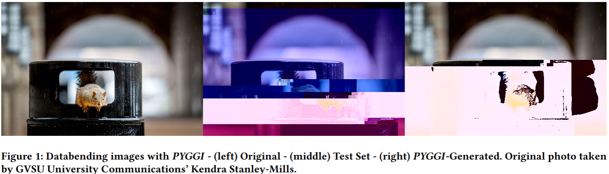

---

# Uncertainty in the art space

*Wasn't the focus of these projects, however...*

<ul>
<li>Use of external libraries</li>
  <ul>
  <li>E.g., <code>pixel-sort</code>, <code>scikit-learn</code>, <code>PyGGI</code> libraries</li>
  </ul>
<li>Architecture differences between machines</li>
<li>Fitness and aesthetic measures</li>
</ul>

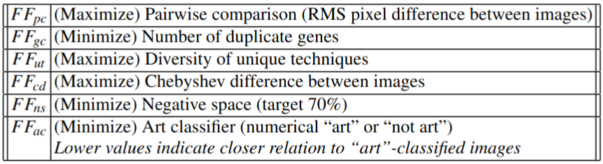

GenerativeGI subset of fitness functions [27].

<!-- translates nicely to games domain -->

---

# Contextualizing for games

&nbsp;
&nbsp;
&nbsp;
&nbsp;
&nbsp;
&nbsp;
&nbsp;
&nbsp;
&nbsp;
&nbsp;
&nbsp;

<!-- # Examples! -->

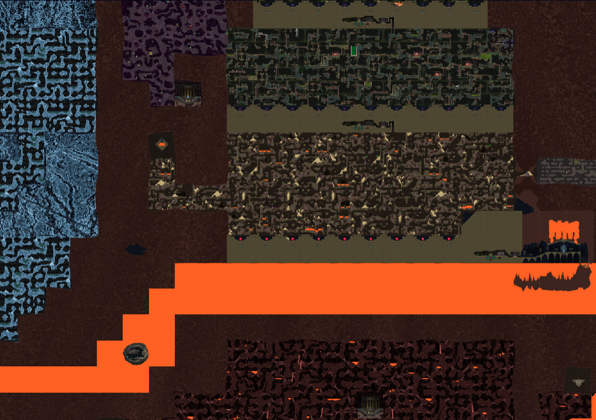
<!--  -->

<!-- _footer: . -->

---

<!-- pick your favorite approach -->

# Things we *should* care about

One person indie game or AAA juggernaut, we should follow **proper documentation and testing procedures**

- Design documents
- Requirements elicitation and derivation
- Software testing at all levels
- *(Hopefully self-evident)*

<!-- _footer: Image c/o https://datarob.com/essentials-software-development-life-cycle/ -->

---

# Gaming-specific concerns

<!-- _footer: Noita gif: a "simple" 2D game" -->

<!-- some computers can barely handle this 2D game -->

(Probably arguable, but...) a game is just another software product with some *special concerns*:

- Users with varying hardware architectures
- Graphics fidelity and system performance
- Multiplayer issues 
...

---

<h1 style="text-align: center !important">Looking at past years for gaming relevance...</h1>

<!-- _footer: Photo by Sonny Sixteen: https://www.pexels.com/photo/round-chain-construction-14742413/ -->

---

# A (random) selection of prior FaSE4Games inclusions

- Unit test generation using large language models for unity game development (Paduraru *et al*. 2024)

- A data-driven analysis of player personalities for different game genres (Li *et al*. 2024)

- Automated bug frame retrieval from gameplay videos using vision-language models (Lu *et al*.  2024)

- Many-objective neuroevolution for testing games (Feldmeier *et al*. 2025)

<!-- interesting to see all the techniques being applied to the SE side of things -->

--- 

# Looking forward

<!-- _footer: Photo by Michael Zittel: https://www.pexels.com/photo/gray-and-black-tower-viewer-near-green-grass-field-and-beach-under-blue-white-and-gray-clouds-143714/ -->

---

# Run-time requirements monitoring

Leverage software sensors to monitor performance

<h3 style="padding:1em !important">
We spent all that time deriving requirements and design documents, we might as well keep using them!
</h3>

<!--
I came out of the automotive industry -- documents were checked into revision control and never used again after their initial use was done
-->

---

# What are some good things to monitor?

This leads us to identifying useful artifacts:

<ol>
  <li>Could consider <i>all</i> requirements or a <i>subset</i> of necessary requirement
  <ul>
    <li>May be cost prohibitive (memory, time, etc.)</li>
    </ul>
  </li>
  <li>Identify requirements that can be used for run-time adjustments
  <ul>
      <li>Or self-adaptation...</li>
      </ul>
  </li>
  <li>Include test cases to provide <i>fine-grained</i> feedback</li>
</ol>

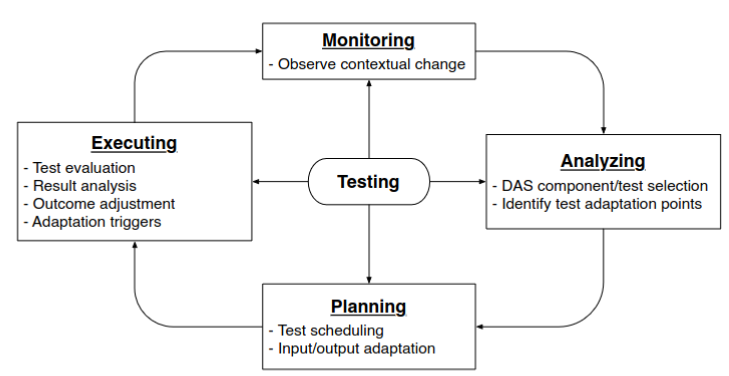

Monitor-Analyze-Plan-Execute-Test (MAPE-T) loop [69].

---

# Consider: moving traditional software testing to run time

<!-- ## Or, things we *should* be doing already -->

Unit/integration/regression/system/acceptance/.../ testing

Are those one-off tests or can we re-use them?
- Much like requirements specs, test specs are great targets for run-time reuse
  - Especially if you consider that run-time uncertainty *might* get caught by those artifacts

Leads to self-healing at run time!

---

# Software testing (esoteric) 

<!-- promised you esoteric in the title -->

Interesting possibilities for testing:

  <ul>
    <li>Run-time testing [21,23]</li>
    <li>Search-based fuzz testing [22], plus SBFT workshop!</li>
    <li>Mutation testing (esoteric, but has industry penetration!) [17,33]</li>
    <li>Neuroevolution for testing [16]!!</li>
  </ul>

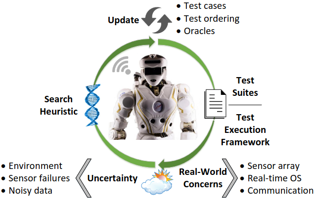

Run-time testing proposal for robots [23]

---

# Genetic improvement [40]

Automatically optimizing a program
- Source code (code transplantation) [40,62]
- Behavior trees or stack-based opcodes

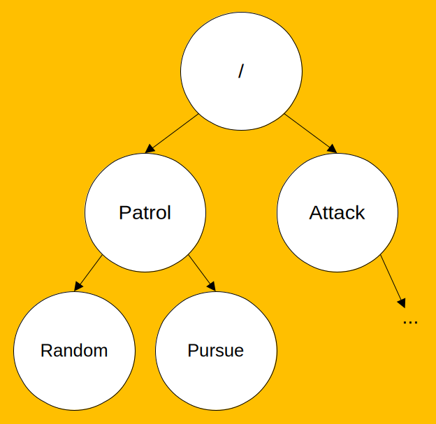

---

# A touch of recent work

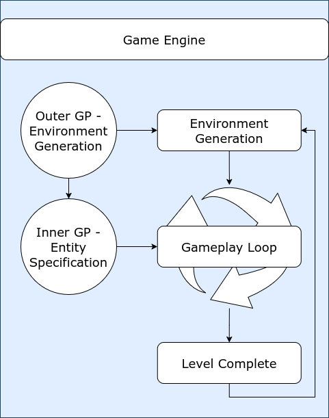

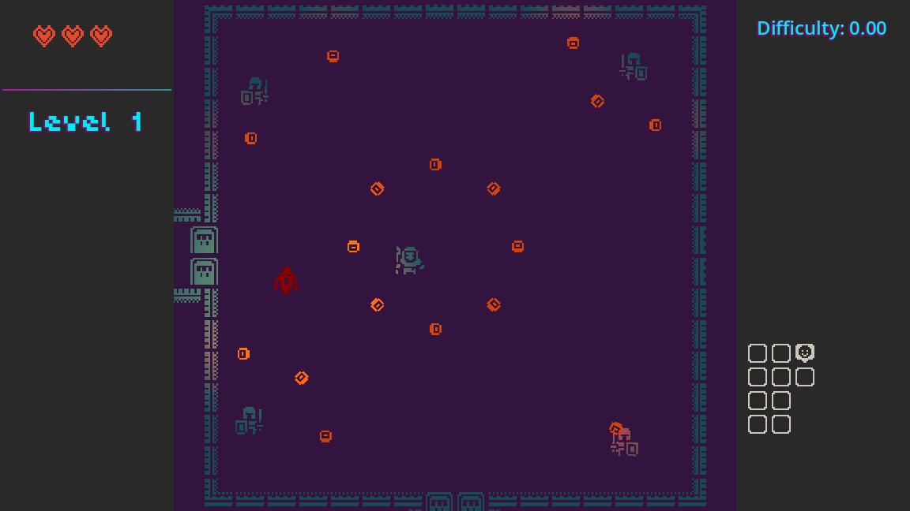

---

### Sample outputs (enemy program opcodes) [26]

<strong>Enemy:</strong> <code class="small-code">WAIT_20,AIM,WAIT_20,FIRE_ONE,WAIT_20,AIM,WAIT_20,FIRE_ONE</code>

<strong>Enemy:</strong> <code class="small-code">WAIT_20,RADIAL_4,FIRE_ALL,WAIT_40,WAIT_20,RADIAL_4,FIRE_ALL,WAIT_40,WAIT_20,RADIAL_8,FIRE_ALL,WAIT_40,WAIT_20,AIM,WAIT_20,FIRE_ONE,WAIT_20,RADIAL_4,FIRE_ALL,WAIT_40,WAIT_20,AIM,WAIT_20,FIRE_ONE,WAIT_20,RADIAL_4,FIRE_ALL,WAIT_40,WAIT_20,RADIAL_8,FIRE_ALL,WAIT_40,WAIT_20,RADIAL_8,FIRE_ALL,WAIT_40,WAIT_20,RADIAL_4,FIRE_ALL,WAIT_40,WAIT_20,RADIAL_8,FIRE_ALL,WAIT_40,WAIT_20,RADIAL_8,FIRE_ALL,WAIT_40,WAIT_20,RADIAL_4,FIRE_ALL,WAIT_40,WAIT_20,RADIAL_8,FIRE_ALL,WAIT_40,WAIT_20,AIM,WAIT_20,FIRE_ONE,WAIT_20,AIM,WAIT_20,FIRE_ONE,WAIT_20,RADIAL_4,FIRE_ALL,WAIT_40,WAIT_20,RADIAL_8,FIRE_ALL,WAIT_40,WAIT_20,RADIAL_4,FIRE_ALL,WAIT_40,WAIT_20,RADIAL_4,FIRE_ALL,WAIT_40,WAIT_20,RADIAL_8,FIRE_ALL,WAIT_40,WAIT_20,RADIAL_8,FIRE_ALL,WAIT_40,WAIT_20,RADIAL_4,FIRE_ALL,WAIT_40,WAIT_20,RADIAL_8,FIRE_ALL,WAIT_40,WAIT_20,RADIAL_4,FIRE_ALL,WAIT_40</code>

<!-- _footer: . -->
<!-- lovely example of GP bloat -->

---

### Sample outputs (room generation) [26]

| | | |
| ----------- | ----------- | ---- |
| 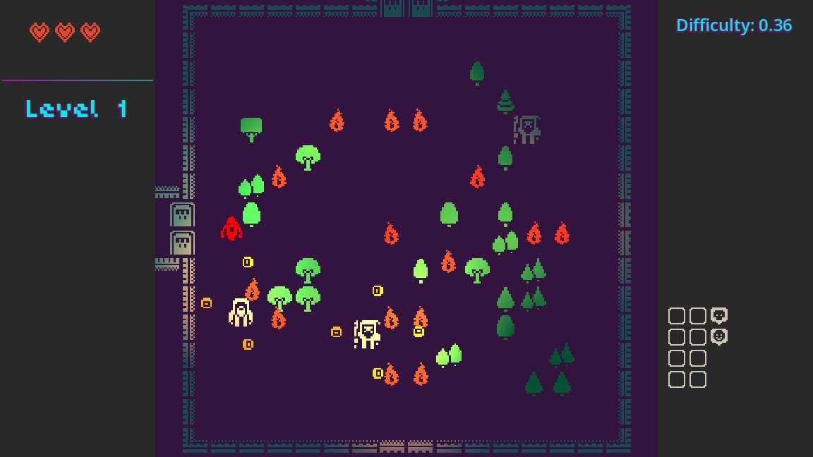 | 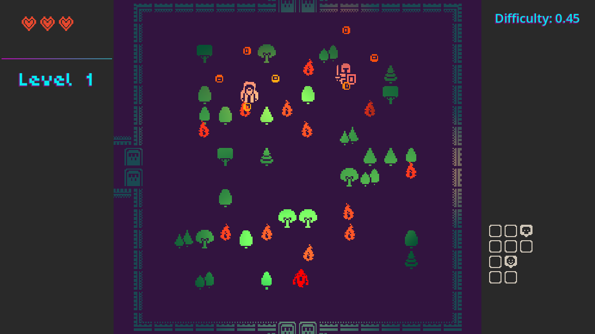 | 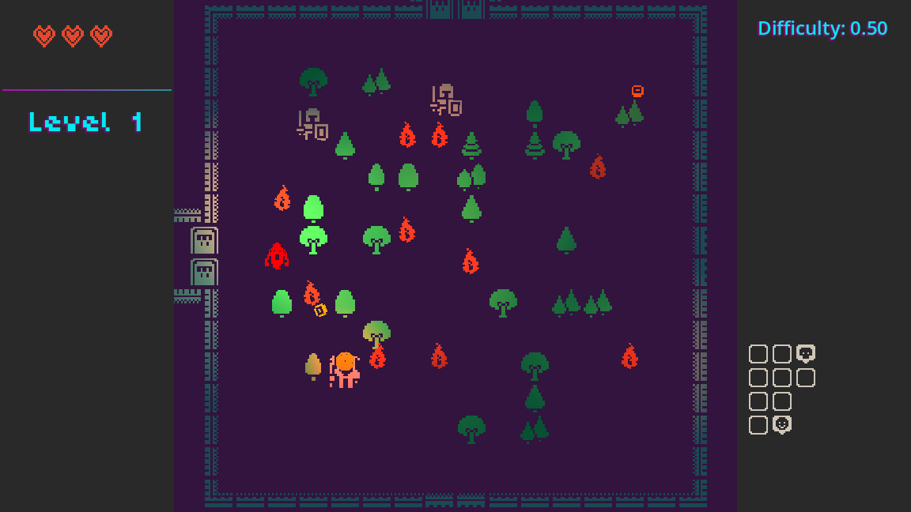
| Difficulty: 0.36 | Difficulty: 0.45 | Difficulty: 0.50

---

# Future areas 

<!-- _footer: . -->

Focusing on the SE areas of improvement:

- Leverage run-time monitors for adapting to gameplay and/or performance metrics
  - E.g., Shadow of Mordor antagonists, tweak performance envelope for different machine specs

- Use artificial life for evolution of game environments and agents [8,9,39] 
  - Life ... finds a way!

- Agentic monitors for continuous improvement [64-66]
  - E.g., mimic players to catch latent bugs
    - Though, keep them out of the creative space

---

# A pitch!

<!-- _footer: . -->

I am currently working on a Dagstuhl seminar proposal centered around SE and games.  If you would like to be included as a participant, please fill out the survey here!

    
  
Survey for Dagstuhl inclusion.

---

# Thank you!

<!-- _footer:Photo by Towfiqu barbhuiya from Pexels: https://www.pexels.com/photo/cursive-text-on-a-paper-11341894/ -->

---

# Discussion

<!-- _footer: Photo by Sonny Sixteen from Pexels: https://www.pexels.com/photo/round-chain-construction-14742413/ --> 

---

# References

<!-- _footer: . -->

<ul id="references">
<li>[1] An, G., Blot, A., Petke, J., & Yoo, S. (2019, August). PyGGI 2.0: Language independent genetic improvement framework. In Proceedings of the 2019 27th ACM Joint Meeting on European Software Engineering Conference and Symposium on the Foundations of Software Engineering (pp. 1100-1104).</li>
<li>[2] Attenberg, J., Ipeirotis, P., & Provost, F. (2015). Beat the machine: Challenging humans to find a predictive model's “unknown unknowns”. Journal of Data and Information Quality (JDIQ), 6(1), 1-17.</li>
<li>[3] Bowers, K. M., Fredericks, E. M., Hariri, R. H., & Cheng, B. H. C. (2020). Providentia: Using search-based heuristics to optimize satisficement and competing concerns between functional and non-functional objectives in self-adaptive systems. Journal of Systems and Software, 162, 110497.</li>
<li>[4] Cai, Y., Miao, C., Tan, A. H., Shen, Z., & Li, B. (2009). Creating an immersive game world with evolutionary fuzzy cognitive maps. IEEE computer graphics and applications, 30(2), 58-70.</li>
<li>[5] Calinescu, R., Ghezzi, C., Johnson, K., Pezzé, M., Rafiq, Y., & Tamburrelli, G. (2015). Formal verification with confidence intervals to establish quality of service properties of software systems. IEEE transactions on reliability, 65(1), 107-125.</li>
<li>[6] Cheng, B. H., Giese, H., Inverardi, P., Magee, J., de Lemos, R., Andersson, J., ... & Whittle, J. (2008). 08031–software engineering for self-adaptive systems: A research road map. Schloss Dagstuhl–Leibniz-Zentrum für Informatik.</li>
<li>[7] Chua Chow, C., & Sarin, R. K. (2002). Known, unknown, and unknowable uncertainties. Theory and Decision, 52(2), 127-138.</li>
<li>[8] Cook, M., Colton, S., & Gow, J. (2016). The angelina videogame design system—part i. IEEE Transactions on Computational Intelligence and AI in Games, 9(2), 192-203.</li>
<li>[9] Cook, M., Colton, S., & Gow, J. (2016). The angelina videogame design system—part ii. IEEE Transactions on Computational Intelligence and AI in Games, 9(3), 254-266.</li>
<li>[10] Dardenne, A., Van Lamsweerde, A., & Fickas, S. (1993). Goal-directed requirements acquisition. Science of computer programming, 20(1-2), 3-50.</li>
<li>[11] Deb, K., Sindhya, K., & Hakanen, J. (2016). Multi-objective optimization. In Decision sciences (pp. 161-200). CRC Press.</li>
<li>[12] DeGrandis, P., & Valetto, G. (2009, June). Elicitation and utilization of application-level utility functions. In Proceedings of the 6th international conference on Autonomic computing (pp. 107-116).</li>
<li>[13] de Pontes, R. G., & Gomes, H. M. (2020, November). Evolutionary procedural content generation for an endless platform game. In 2020 19th Brazilian Symposium on Computer Games and Digital Entertainment (SBGames) (pp. 80-89). IEEE.</li>
</ul>

---

# References
<!-- _footer: . -->

<ul id="references">
<li>[14] DeVries, B., & Fredericks, E. M. (2024). Triggering Adaptation via Contextual Metamorphic Relations. 2024 IEEE 24th International Conference on Software Quality, Reliability and Security (QRS), 105–114.</li>
<li>[15] Fakour, F., Mosleh, A., & Ramezani, R. (2024). A structured review of literature on uncertainty in machine learning & deep learning. arXiv preprint arXiv:2406.00332.</li>
<li>[16] Feldmeier, P., Schmelz, K., & Fraser, G. (2025, March). Many-objective neuroevolution for testing games. In 2025 IEEE Conference on Software Testing, Verification and Validation (ICST) (pp. 244-254). IEEE.</li>
<li>[17] Fraser, G., & Arcuri, A. (2011, September). Evosuite: automatic test suite generation for object-oriented software. In Proceedings of the 19th ACM SIGSOFT symposium and the 13th European conference on Foundations of software engineering (pp. 416-419).</li>
<li>[18] Fredericks, E. M., DeVries, B., & Cheng, B. H. (2014). AutoRELAX: automatically RELAXing a goal model to address uncertainty. Empirical Software Engineering, 19(5), 1466-1501.</li>
<li>[19] Fredericks, E. M., Diller, A. C., & DeVries, B. (2026).  Managing Dermal Reference Guides in the Face of Software Evolution via a CI/CD Pipeline. In 26th ACH Special Interest Group on Harry Quadragesimal Bovik (SIGBOVIK). Association for Computational Heresy (ACH).</li>
<li>[20] Fredericks, E. M., DeVries, B., & Hariri, R. (2026). Databending as a Target for Genetic Improvement. To Be Published in the 2026 15th International Workshop on Genetic Improvement (GI).</li>
<li>[21] Fredericks, E. M., Jacobs, M., & DeVries, B. (2024). Towards a Metamorphic Testing Architecture for Software-Defined Drone Systems. 2024 11th International Conference on Software Defined Systems (SDS), 170–177. https://doi.org/10.1109/SDS64317.2024.10883896</li>
<li>[22] Fredericks, E. M., & Burden, S. (2024). Towards Fuzz Testing a Procedurally-Generated Video Game. To Appear in the Proceedings of the 2024 ASEE North Central Section Conference (ASEE NCS).</li>
<li>[23] Fredericks, E. M., Bowers, K. M., & Hariri, R. H. (2019). On incorporating search-based heuristics into real-world systems. 2019 IEEE/ACM 12th International Workshop on Search-Based Software Testing (SBST), 11–12.</li>
<li>[24] Fredericks, E. M., Gerostathopoulos, I., Krupitzer, C., & Vogel, T. (2019). Planning as optimization: Dynamically discovering optimal configurations for runtime situations. 2019 IEEE 13th International Conference on Self-Adaptive and Self-Organizing Systems (SASO), 1–10.</li>
<li>[25] Fredericks, E. M., & Moore, J. M. (2020). Search@ Home: A Commercial Off-the-Shelf Environment for Investigating Optimization Problems. International Symposium on Search Based Software Engineering, 171–177. </li>
<li>[26] Fredericks, E. M., Moore, J. M., & DeVries, B. (2026). Every Map an Evolution, Every Room a Generation: Co-Evolution in a Procedurally-Generated Video Game. To appear in Genetic Programming Theory and Practice XXIII. Singapore: Springer Nature Singapore.</li>
</ul>

---

# References
<!-- _footer: . -->

<ul id="references">
<li>[27] Fredericks, E. M., Bobeldyk, D., & Moore, J. M. (2025). Crafting generative art through genetic improvement: Managing creative outputs in diverse fitness landscapes. In Genetic Programming Theory and Practice XXI (pp. 321-335). Singapore: Springer Nature Singapore.</li>
<li>[28] Gigliotta, O., Miglino, O., Schembri, M., & Di Ferdinando, A. (2014). Building up serious games with an artificial life approach: Two case studies. In Evolution, complexity and artificial life (pp. 149-158). Berlin, Heidelberg: Springer Berlin Heidelberg.</li>
<li>[29] Goodling, A., Schneider, C., Fredericks, E. M., and Hariri, R. (2026). Antagonistic Development via Intentional Software Churn. To appear in the Proceedings of the 2026 ASEE National Conference.</li>
<li>[30] Hastings, E. J., Guha, R. K., & Stanley, K. O. (2009). Automatic content generation in the galactic arms race video game. IEEE Transactions on Computational Intelligence and AI in Games, 1(4), 245-263.</li>
<li>[31] Hendrikx, M., Meijer, S., Van Der Velden, J., & Iosup, A. (2013). Procedural content generation for games: A survey. ACM Transactions on Multimedia Computing, Communications, and Applications (TOMM), 9(1), 1-22.</li>
<li>[32] Holland, J. H. (1992). Adaptation in natural and artificial systems: an introductory analysis with applications to biology, control, and artificial intelligence. MIT press.</li>
<li>[33] Huang, C., Zhou, H., Zhao, H., Cai, W., Zhou, Z. Q., & Jiang, M. (2022, December). On the Usefulness of Crossover in Search-Based Test Case Generation: An Industrial Report. In 2022 29th Asia-Pacific Software Engineering Conference (APSEC) (pp. 417-421). IEEE.</li>
<li>[34] Lakkaraju, H., Kamar, E., Caruana, R., & Horvitz, E. (2017, February). Identifying unknown unknowns in the open world: Representations and policies for guided exploration. In Proceedings of the AAAI Conference on Artificial Intelligence (Vol. 31, No. 1).</li>
<li>[35] La Cava, W., Helmuth, T., Spector, L., & Moore, J. H. (2019). A probabilistic and multi-objective analysis of lexicase selection and ε-lexicase selection. Evolutionary Computation, 27(3), 377-402.</li>
<li>[36] Lehman, J., & Stanley, K. O. (2011). Novelty search and the problem with objectives. In Genetic programming theory and practice IX (pp. 37-56). New York, NY: Springer New York.</li>
<li>[37] Li, K., Wang, R., Zhang, T., & Ishibuchi, H. (2018). Evolutionary many-objective optimization: A comparative study of the state-of-the-art. Ieee Access, 6, 26194-26214</li>
<li>[38] Mitra, S., Wongpiromsarn, T., & Murray, R. M. (2013). Verifying cyber-physical interactions in safety-critical systems. IEEE Security & Privacy, 11(4), 28-37.</li>
<li>[39] Ofria, C., & Wilke, C. O. (2004). Avida: A software platform for research in computational evolutionary biology. Artificial life, 10(2), 191-229.</li>
</ul>

---

# References
<!-- _footer: . -->

<ul id="references">
<li>[40] Petke, J., Haraldsson, S. O., Harman, M., Langdon, W. B., White, D. R., & Woodward, J. R. (2017). Genetic improvement of software: a comprehensive survey. IEEE Transactions on Evolutionary Computation, 22(3), 415-432.</li>
<li>[41] Pugh, J. K., Soros, L. B., Frota, R., Negy, K., & Stanley, K. O. (2017, September). Major evolutionary transitions in the voxelbuild virtual sandbox game. In Artificial Life Conference Proceedings (pp. 553-560). One Rogers Street, Cambridge, MA 02142-1209, USA journals-info@ mit. edu: MIT Press.</li>
<li>[42] Ramirez, A. J., Fredericks, E. M., Jensen, A. C., & Cheng, B. H. (2012, September). Automatically relaxing a goal model to cope with uncertainty. In International Symposium on Search Based Software Engineering (pp. 198-212). Berlin, Heidelberg: Springer Berlin Heidelberg.</li>
<li>[43] Ramirez, A. J., & Cheng, B. H. (2011, October). Automatic derivation of utility functions for monitoring software requirements. In International Conference on Model Driven Engineering Languages and Systems (pp. 501-516). Berlin, Heidelberg: Springer Berlin Heidelberg.</li>
<li>[44] Rushby, J. (2009, November). Software verification and system assurance. In 2009 Seventh IEEE International Conference on Software Engineering and Formal Methods (pp. 3-10). IEEE.</li>
<li>[45] Rollings, A. (2010). Fundamentals of game design.</li>
<li>[46] Saunders, F. C., Gale, A. W., & Sherry, A. H. (2016). Responding to project uncertainty: Evidence for high reliability practices in large-scale safety–critical projects. International Journal of Project Management, 34(7), 1252-1265.</li>
<li>[47] Sawyer, P., Bencomo, N., Whittle, J., Letier, E., & Finkelstein, A. (2010, September). Requirements-aware systems: A research agenda for re for self-adaptive systems. In 2010 18th IEEE International Requirements Engineering Conference (pp. 95-103). IEEE.</li>
<li>[48] Shaker, N., Togelius, J., & Nelson, M. J. (2016). Procedural content generation in games.</li>
<li>[49] Soize, C. Uncertainty Quantification: An Accelerated Course with Advanced Applications in Computational Engineering. 2016. Citado en, 6.</li>
<li>[50] Spector, L. A. (1992). Supervenience in dynamic-world planning. University of Maryland, College Park.</li>
<li>[51] Stanley, K. O., Bryant, B. D., & Miikkulainen, R. (2005). Real-time neuroevolution in the NERO video game. IEEE transactions on evolutionary computation, 9(6), 653-668.</li>
<li>[52] Streasick, S., Fredericks, E., DeVries, B., & Woodring, I. (2025, June). Incorporating Multiple Self-Adaptive Agents in Games. In Proceedings of the 33rd ACM International Conference on the Foundations of Software Engineering (pp. 1469-1476).</li>
<li>[53] Taylor, T., Bedau, M., Channon, A., Ackley, D., Banzhaf, W., Beslon, G., ... & Wiser, M. (2016). Open-ended evolution: Perspectives from the OEE workshop in York. Artificial life, 22(3), 408-423.</li>
<li>[54] Togelius, J., Champandard, A. J., Lanzi, P. L., Mateas, M., Paiva, A., Preuss, M., & Stanley, K. O. (2013). Procedural content generation: Goals, challenges and actionable steps.</li>
</ul>

---

# References
<!-- _footer: . -->

<ul id="references">
<li>[55] Troya, J., Moreno, N., Bertoa, M. F., & Vallecillo, A. (2021). Uncertainty representation in software models: a survey. Software and Systems Modeling, 20(4), 1183-1213.</li>
<li>[56] Tyralis, H., & Papacharalampous, G. (2024). A review of predictive uncertainty estimation with machine learning. Artificial Intelligence Review, 57(4), 94.</li>
<li>[57] Van Lamsweerde, A. (2009). Requirements engineering: From system goals to UML models to software (Vol. 10, p. 34). Chichester, UK: John Wiley & Sons.</li>
<li>[58] Walsh, W. E., Tesauro, G., Kephart, J. O., & Das, R. (2004, May). Utility functions in autonomic systems. In International Conference on Autonomic Computing, 2004. Proceedings. (pp. 70-77). IEEE.</li>
<li>[59] Wang, K., Shen, C., Li, X., & Lu, J. (2025). Uncertainty quantification for safe and reliable autonomous vehicles: A review of methods and applications. IEEE Transactions on Intelligent Transportation Systems.</li>
<li>[60] Whittle, J., Sawyer, P., Bencomo, N., Cheng, B. H., & Bruel, J. M. (2009, August). Relax: Incorporating uncertainty into the specification of self-adaptive systems. In 2009 17th IEEE International Requirements Engineering Conference (pp. 79-88). IEEE.</li>
<li>[61] Wickham, L. (2026). Risk Management for Video Game Professionals: Navigating Uncertainty in Game Development. CRC Press.</li>
<li>[62] Zamorano López, M. D. M., Blasco, D., Cetina, C., & Sarro, F. (2025, April). Video game procedural content generation through software transplantation. In International Conference on Software Engineering: Software Engineering in Practice. IEEE/ACM.</li>
<li>[63] Zenva. (2026). Build a Complete Roguelike from Scratch with Godot. https://academy.zenva.com/course/godot-roguelike-course/</li>
<li>[64] Zhang, D., Liu, X., Cheng, L., Wang, Y., Murray, K., & Wei, H. (2026). SELAUR: Self Evolving LLM Agent via Uncertainty-Aware Rewards. In Pacific-Asia Conference on Knowledge Discovery and Data Mining (pp. 424-436). Springer, Singapore.</li>
<li>[65] Zhang, J., Choubey, P. K., Huang, K. H., Xiong, C., & Wu, C. S. (2026). Agentic Uncertainty Quantification. arXiv preprint arXiv:2601.15703.</li>
<li>[66] Zhang, M., Yue, T., Aguirre, N. M., Garbervetsky, D., & Uchitel, S. (2026). Agentic Generation and Evolution of Knowledge Models. arXiv preprint arXiv:2606.03662.</li>
<li>[67] Ziv, H., Richardson, D., & Klösch, R. (1997, May). The uncertainty principle in software engineering. In submitted to Proceedings of the 19th International Conference on Software Engineering (ICSE'97).</li>
<li>[68] Fredericks, E. M. (2016, May). Automatically hardening a self-adaptive system against uncertainty. In Proceedings of the 11th International Symposium on Software Engineering for Adaptive and Self-Managing Systems (pp. 16-27).</li>
<li>[69] Fredericks, E. M., Ramirez, A. J., & Cheng, B. H. C. (2013). Towards run-time testing of dynamic adaptive systems. 2013 8th International Symposium on Software Engineering for Adaptive and Self-Managing Systems (SEAMS), 169–174.</li>
</ul>

---

# Other slides

---

# Dream project

<!-- Harman's dream auto-created compiler reference -->

<!-- _paginate: false -->

Everything **fully evolved** and yet:

- Cohesive across game
- Clearly communicative to player
- Enjoyable!

<!-- an evolved dwarf fortress -->
---

# RELAXation [60] as a target for evolution

<!-- _paginate: false -->

<!-- 
in progress, but applying relaxations to PCG requirements
-->

---