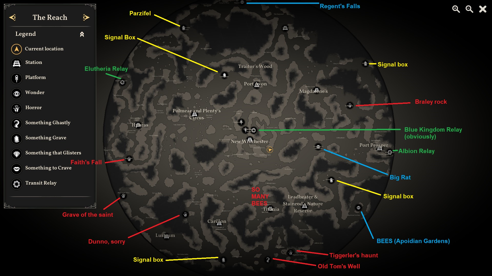

<!-- 40+20 -->

<style> @import url('./cis241.css'); </style>

<!-- Description: Uncertainty can impact games given the numerous uncertainties involved, from supporting a wide range of hardware architectures and interfaces to managing unexpected human interactions.  The failure of systems in gaming due to uncertainty, whether a hard crash or a performance slowdown, can lead to player frustration and disengagement.  In this talk I will discuss approaches that my lab has explored for both discovering and managing uncertainty from a software engineering perspective that can be applied to games, from requirements monitoring at run time to search-based fuzz testing.  I'll also cover its applications in other domains such as safety-critical systems and algorithmic art to demonstrate the domain-independence of these techniques.  I'll end with a discussion of potential future directions that can be explored in the context of uncertainty and game development. -->

<!-- # Bridging Esoteric Software Engineering Practices to the Video Games Domain -->
<!-- # Opportunities for Esoteric Software Engineering Practices in Games -->
# Opportunities for Esoteric Software Engineering Practices for Managing Uncertainty in Games

### FaSE4Games Keynote (07/05/2026)

Erik Fredericks, frederer@gvsu.edu

> [https://efredericks.github.io](https://efredericks.github.io)


<!--  -->


---

<!-- _footer: . -->

# Acknowledgements 

<div class="container">
<div class="col">
<b>Current/Former Students</b>
<p>(Too many to list, but most recently)</p>
<ul>
<li>Abigail Diller</li>
<li>Steven Streasick</li>
<li>Mallory Jacobs</li>
<li>Skyler Burden</li>
<li>Cameron Schneider</li>
<li>Andrew Goodling</li>
<li>Astha Thapa</li>
<li>...and more!</li>
</ul>
</div>
<div class="col-mid">
<b>Collaborators and Mentors</b>
<ul>
<li>Byron DeVries</li>
<li>Jared Moore</li>
<li>Ira Woodring</li>
<li>Betty H. C. Cheng</li>
<li>Austin Ferguson</li>
<li>Alex Lalejini</li>
</ul>
</div>
<div class="col-right">
<b>Sponsors</b>
<ul>
<li>Grand Valley State University</li>
<li>Michigan Space Grant Consortium</li>
<li>National Science Foundation</li>
</ul>
</div>
</div>

<!-- primarily undergrad institution -->

---

# What is the purpose of this keynote?

Dealing with **uncertainty** and its insidious impacts on software systems

More specifically?
- Causing requirements violations
- Inducing performance slowdowns
- Crashes!


<!-- _footer: Photo by Михаил Крамор from Pexels: https://www.pexels.com/photo/angry-girl-sitting-at-desk-in-classroom-16876741/ -->

---

# Why is this interesting to you specifically?

I'm not pitching you a career's worth of work but rather opportunities for future work

What we'll be talking about :

- Recognizing and quantifying uncertainty
- Techniques for managing uncertainty
- Potential future options in this area 

---

# Who am I?

- Until recently, a person who has focused on managing uncertainty in safety-critical systems with search-based software engineering 

  - E.g., robotics [], self-adaptive systems []

- And then:

  - Algorithmic art []
  - Procedural content generation []

<!-- _footer: (Background image: [Etienne Jacob](https://necessarydisorder.wordpress.com/2017/11/15/drawing-from-noise-and-then-making-animated-loopy-gifs-from-there/)) -->


---

# What is uncertainty?

Uncertainty is:

- Insidious
- Difficult to quantify
- Difficult to *recognize*

Uncertainty causes your software to react/behave in ways unintended
- This should worry you as a software engineer!

<!--
- Robots crash and people die
- Video games crash and people trash your game online
-->


<!-- _footer: Photo by Julia Filirovska from Pexels: https://www.pexels.com/photo/misted-window-with-question-mark-4913769/ -->

---

# Consider...

You are programming a robot

<div class="container">
  <div class="col">
    <ul>
      <li>A camera lens gets scratched</li>
      <li>A sensor gets bumped and becomes misaligned</li>
      <li>A typo is entered into a config file</li>
    </ul>
    <b>How does that impact the robot's goals?</b>
  </div>

  <div class="col-right">
  <iframe width="560" height="315" src="https://www.youtube.com/embed/svovLytCkMw?si=GbgPbsBMpvcl0JiJ" title="YouTube video player" frameborder="0" allow="accelerometer; autoplay; clipboard-write; encrypted-media; gyroscope; picture-in-picture; web-share" referrerpolicy="strict-origin-when-cross-origin" allowfullscreen></iframe>
  </div>
</div>

<!-- 
what is the uncertainty here?
-->


---

# Defining uncertainty

Interestingly, there are a plethora of ways to describe uncertainty depending on your domain.  I fall in the []:

| **Type** | **Description** | 
| ----------- | ----------- | 
| Known known | We **know** the source **and** how much impact it will have |
| Unknown known | We **don't know** the source but do **know** its impact |
| Known Unknown | We **know** the source but **don't know** its impact |
| Unknown unknown | We **don't know** the source and **don't know** its impact |

<!-- _footer: . -->
<!-- could also go the aleatory (inherent randomness/noise) and epistemic (lack of knowledge) route as well -->

---

# Defining uncertainty

<!-- _footer: . -->

<div class="container">
<div class="col">
<p>This leads us to:</p>
<ul>
<li><strong>Sources of uncertainty</strong></li>
<li><strong>Impact of uncertainty</strong></li>
</ul>
</div>
<div class="col">

<p class="reference">Genome for Ragnarok genetic algorithm []</p>
</div>
</div>


It is <mark>humanly impossible</mark> to enumerate all possible combinations of each


<!--
can we find the most impactful or put the system into a good enough state
-->

---

<!-- _footer: . -->

# Examples of uncertainty

Safety-critical systems
- Unexpected weather
- Human interaction
- System misconfiguration

Video games
- Network issues (also works for above)
- Human interaction
- System misconfiguration


*Formal methods for quantification exist as well via probability analysis, statistical modeling, etc.* [Uncertainty Quantification, Soize]

---

# How can we handle it from a software engineering perspective?

- Run-time monitoring **
- Verification and validation []
- Machine learning []
- Agentic monitors [SELAUR: Self Evolving LLM Agent via Uncertainty-aware Rewards]

---

# Software engineering and uncertainty

Generating and monitoring problems:

- Robot with random sensor failures/degradations
- Remote data mirroring with severed links

Experiencing:

- Unsatisfied requirements
- Violated invariants
- Poor performance

---

# Software engineering and uncertainty - How do we know?

One concern can be the additional overhead of monitors

*Lightweight* monitoring requirements satisfaction *at run time* -- utility functions []
- Derive mathematical functions for each requirement/goal to assess performance

---

# Utility functions


---

<div class="over-img">
<h1>Leaving the safety-critical space</h1>
</div>


<!-- _footer:. -->

---

# Search-based software engineering

background
will show sbst/ragnarok/valkyrie later

---

# An example (self-adaptive)

---

# GenerativeGI []

Using evolutionary computation and software engineering to create glitch art

- Many-objective search with Lexicase selection

- Fitness proxies for aesthetic preference
 
  - Maximizing pixel differences in images
  - Maximizing negative space
  - Maximizing diversity of drawing techniques
  - ...

---

# Uncertainty in the art space

*Wasn't the focus of the work, however...*

- Use of external libraries
- Architecture differences between machines
- Fitness measures
  

---

# Contextualizing for games

&nbsp;
&nbsp;
&nbsp;
&nbsp;
&nbsp;
&nbsp;
&nbsp;
&nbsp;
&nbsp;
&nbsp;
&nbsp;

<!-- # Examples! -->


<!-- _footer: . -->

---

# Requirements monitoring

---

# Software testing (basic)


---

# Software testing (esoteric) 

---
---
---
---
---
---
---
---
---
---
---
---
---
---


---

# Discussion

---

# A pitch!


I am currently working on a Dagstuhl seminar proposal.  If you would like to be included as a participant, please fill out the survey here!

(QR code)

---

# Thank you!


<!-- _footer:Photo by Towfiqu barbhuiya from Pexels: https://www.pexels.com/photo/cursive-text-on-a-paper-11341894/ -->

---

# References

---

# But first, **how** do we make a game map?




(and, what does the data structure look like?)

<!-- _footer: . -->

---

# Any reason for not doing it by hand?


---

<!-- # Examples! -->


---

# Procedural Content Generation (PCG)

What is PCG?
- Algorithmically-placing content!

Why is PCG?
- Save the developer/designer time and effort!
  - One would think...

Why bother talking about this?
- I recently sent out a paper on it and thought you might find it interesting
- Plus, useful for gamejam things

---

# Basic concept

Use math/algorithms to place content intelligently
- Dungeons, items, etc.

Noise functions:
- Calculate a noise value based on inputs and configurations
- Your job is to map that value to something useful


---

# For example - Perlin noise

Typically, returns a value in [-1.0, 1.0], though p5js uses [0.0, 1.0]

For example (in p5):
`let n = noise(x * 0.01, y * 0.01);`

- `n = [0.0, 0.5] -- (x, y) -> water`
- `n = (0.5, 0.6] -- (x, y) -> beach`
- `n = (0.6, 0.9] -- (x, y) -> grass`
- `n = (0.9, 1.0] -- (x, y) -> rock`

You do *effectively* the same in any language/editor!

There are other noise functions!  Worley noise, Simplex noise, etc.

---

# How does noise generate this?


---

# Demo time

<div class="callout-dark" style="background:#333"><a href="https://tinyurl.com/24c9sftw">https://tinyurl.com/24c9sftw</a></div>


This time I made a pre-baked p5js template for you.  Go to this link and `File -> Duplicate`
- Make sure you login and save often

## The sketch

- You should have a little ASCII happy face that you can move around with your arrow keys
- Your game map is represented as a **two-dimensional grid** where the first index is the row and the second index is the column
- There is also a basic camera that follows your player so that we can make big maps

<!-- _footer: . -->

---

# The map

```js
[['#', '#', '#', ..., '#'],
 ['#', ' ', ' ', ..., '#'],
 ['#', '.', 't', ..., '#'],
 [...],
 ['#', '#', '#', ..., '#']]
```

`game_map[2][1]` returns a ???
* `.`

By default, the map puts walls on the outside and nothing on the inside - your job is to fill it with things

---

# Valid things:

| Character | Walkable? | Represents |
| ----------- | ----------- | ---- |
| `#` | No | Stone wall
| `t` | No | Tree
| `w` | No | Water
| ` ` | Yes | Empty space
| `.` | Yes | Pebbles
| `g` | Yes | Grass

Try setting some random cells to these characters!
- such as, `game_map[2][3] = 'g';` in `setup()` AFTER the game map is created


<div class="callout">Try hitting <code>~</code> and see what happens!</div>

<!-- _footer: . -->

---

# First, let's randomize things

After the call to `setupGameMap()` (which again, just gives us an empty grid with borders)

```js
for (let r = 1; r < num_rows - 1; r++) {
  for (let c = 1; c < num_cols - 1; c++) {
    let r = random();
    let ch = ' ';
    if (r > 0.8) ch = '#';

    game_map[r][c] = ch;
  }
}
```

<div class="callout">Is this something interesting?</div>

---

# Now let's give it a bit of detail 

First, comment out what you did inside that double loop.

```js
const zoom = 0.01;
for (let r = 1; r < num_rows - 1; r++) {
  for (let c = 1; c < num_cols - 1; c++) {
    let ch = ' ';
    let n = noise(c * zoom, r * zoom);


    // fill in with code from next slide


    game_map[r][c] = ch;
  }
}
```
<!-- _footer: . -->

---

# The noise bit

```js
if (n <= 0.5) ch = 'w';
else if (n <= 0.6) ch = 'b';
else if (n <= 0.9) ch = 't';
else {
  let r = random();
  if (r > 0.8) ch = '.';
  else ch = ' ';
}
```

---

# The finesse bit

Now this is the tricky part - you need to play with the `zoom` value and the `noiseDetail` (at the top) values to get exactly the output you want!

Try varying the:

- `zoom` into the noise distribution (try `0.1`, `0.001`, etc.)
- [https://p5js.org/reference/p5/noiseDetail/](https://p5js.org/reference/p5/noiseDetail/)
    - The number of octaves (first parameter in `noiseDetail`) - `[1, 16]` usually show interesting values
    - The falloff amount (second parameter in `noiseDetail`) - `[0.0, 1.0]`

---

# Other ways to do it!

Use a different algorithm!
- Rectangular room placement
- Cellular automata
- **Wave function collapse** ->
- ...


> There's a cellular automata implementation in the demo - instead of building your map in `setup` try calling `game_map = CA();`