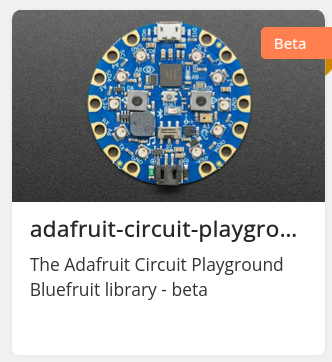
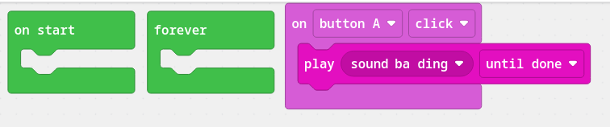
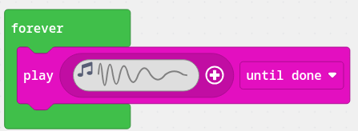
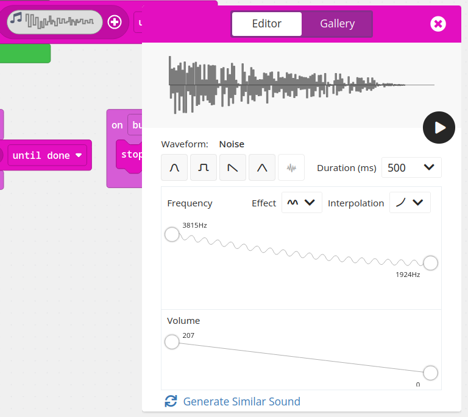
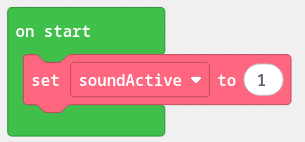
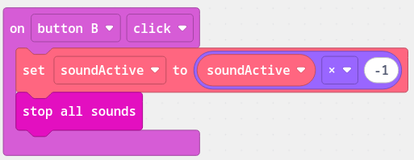
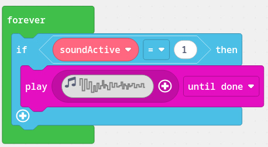
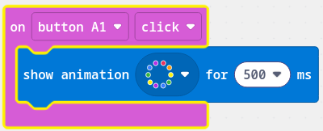
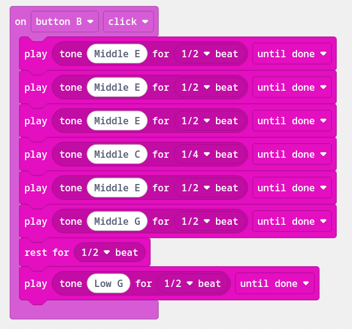

# Hands-On with the Adafruit CircuitPlayground Bluefruit

## High school visit (04/20/2026)

Erik Fredericks, frederer@gvsu.edu
Winter 2026

[https://efredericks.github.io](https://efredericks.github.io)

---

# Plan for today

1. Block programming in a simulator

2. Program device

3. Try it out on the speakers!

---

# Block programming

In a browser, go to:

## https://maker.makecode.com

---

# First steps

1. Click 'New Project'

2. Give it a name!

3. Click create and then select the **adafruit-circuit-playground-bluefruit**

<!-- show the simulator now -->

---

# Make a sound!

Let's make a sound on a button press.

Click `Input` and get an `on button A click` field.

- Anything in that block will run when you click a button
- You can put any action in there!

Now, pop a sound in.  Click `Music` and then `play sound ba ding until done` and drag that *inside* the button event.
- You can change the sound by clicking the drop down!

<!-- _footer: . -->

---

# Download to the device!

This is all on your computer - let's put it on a device!

1. Click the `Download` button - a `*.uf2` file will download to your computer.

2. Make sure the device is plugged in!  If you don't see a `CPLAYBTBOOT` folder in your file explorer then click the small button in the middle of to reset it.
- If it still doesn't work, try clicking it twice to put it into bootloader mode.

3. Drag the `.uf2` file onto your `CPLAYBTBOOT` directory
- It should auto-load - if not try resetting it!

---

# Now some forever sounds!

Add the `play <waveform>` node to your `forever` block
- Play with the waveform by clicking on it and moving the points around!

---

# Now make a variable and turn it on/off!

First add a variable - click `Variables` and `Make a variable` and call it `soundActive`

Then, drag the `set soundActive to 0` field to the `on start` block
- Set its value to be `1`

---

# And change the variable

Add another button block and have it respond to Button B.

Inside that block, change the `soundActive` variable to be the opposite!

Also, add the `stop all sounds` block so that things stop!

---

# And then, the if statement

In your `forever` block, add an `if` statement to play sound!  This will involve adding a bunch of things, so good luck!

---

# Create a lightshow on touch

Add another input, this time for a touch sensor

Then, add a lightshow!

---

# Hook up to a speaker!

If you want to test out your program on a *better* speaker, here's how it can be wired up!

* Connect the `GND` pad (ground) to the base of the audio connector
* Connect the tip of the audio connector to the `AUDIO` pad

<!-- _footer: . -->

---

# Have some fun!

