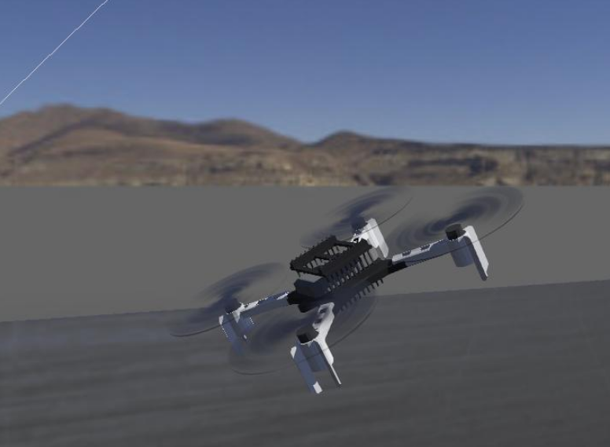
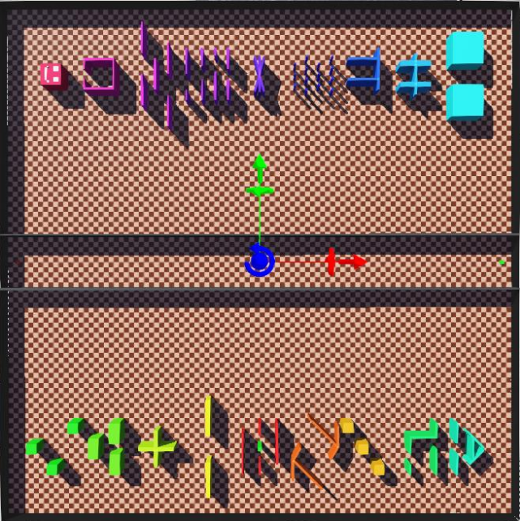

# Sabbatical Proposal - Overview

## Expanding Capabilities by Learning the Robot Operating System (ROS) for Software Engineering Research 

Erik Fredericks, frederer@gvsu.edu

---

# Sabbatical: Fall 2026 - Winter 2027

## Why?

- Gain experience with the <u>Robot Operating System (ROS)</u> and its simuator <u>Gazebo</u> for <u>software engineering research</u> and developing <u>educational modules</u>

- Existing experience with lightweight simulators 
  - Not very realistic!

- ROS is often considered to be <u>painful</u> but far more <u>realistic</u>

---

<!-- footer: . -->

| Winter 2026 | Fall 2026 | Winter 2027 |
| --- | --- | --- |
| Pre-planning | OER learning module development | Research project (minimizing uncertainty for ROS-based systems) | 
| ROS/Gazebo setup | Conversion of existing project to ROS | Grant writing (NSF SHF Future CoRe, AFRL Foundations of Trusted Systems, US Naval Research Laboratory Basic/Applied Research) | 
| Discussions with B. Cheng | OER dissemination | Research dissemination |

OER materials: enable students (either research or in-classroom) to <u>quickly</u> get up and running with robotics simulations

---

# Post-sabbatical

- Develop SE/AI-focused robotics course
- Disseminate remaining work
- Present outcomes to GVSU